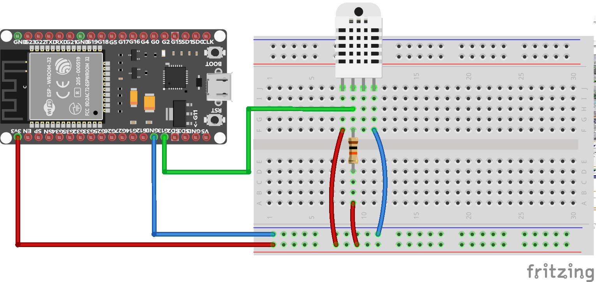

# Meranie teploty a vlhkosti so sensorom DHT11/DHT22

## Senzory DHT11/DHT22

* podpora priamo v micropython-e

## Schéma zapojenia



## REPL

## Riešenie


```python
from machine import Pin
from dht import DHT22

sensor = DHT22(Pin(13))
sensor.measure()
print(sensor.temperature())
print(sensor.humidity())
```

## Ďalšie úlohy

1. Pripojte LED diódu ku niektorému z digitálnych pinov. Pred začatím každého merania LED diódu rozsvieťte a po jeho skončení ju zhasnite.
2. Pripojte k niektorému z digitálnych vstupných pinov tlačidlo. Zabezpečte, aby sa teplota odčítala zakaždým, keď sa tlačidlo stlačí.
3. Pripojte ku obvodu (aspoň) dvojriadkový displej. Na vrchný riadok vypíšte teplotu a na dolný riadok vypíšte vlhkosť.

## Odkazy

* datasheet
* dokumentácia modulu `dht`

## Licencia

Pokiaľ nie je uvedené inak, obsah tohto dokumentu je licencovaný licenciou [Creative Commons Attribution-NonCommercial-ShareAlike 4.0 International (CC BY-NC-SA 4.0)](https://creativecommons.org/licenses/by-nc-sa/4.0/).

   