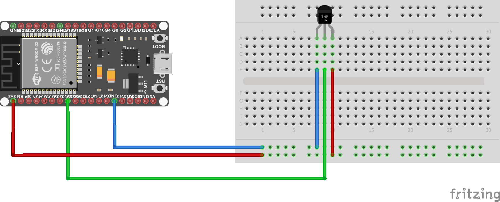

# Meranie teploty s analógovým senzorom TMP36

## Senzor TMP36

 **Temperature range:** -40°C to 150°C / -40°F to 302°F

 **Output range:** 0.1V (-40°C) to 2.0V (150°C) but accuracy decreases after 125°C

 **Power supply:** 2.7V to 5.5V only, 0.05 mA current draw


## A/D prevodník na ESP32

* 18 Analog-to-Digital Converter (ADC) channels
* On the ESP32 ADC functionality is available on Pins 32-39. Note that, when using the default configuration, input voltages on the ADC pin must be between 0.0v and 1.0v (anything above 1.0v will just read as 4095).  Attenuation must be applied in order to increase this usable voltage range.
* 12 bitový A/D prevodník - rozlíšenie je teda _2^12 = 4096_

## Schéma zapojenia

Dátový pin senzora _TMP36_ je privedený na GPIO pin _33_ mikrokontroléra _ESP32_. Schéma zapojenia je zobrazená na nasledujúcom obrázku:



## REPL

Začneme tým, že z balíka `machine` importujeme triedy `Pin` a `ADC`:

```python
>>> from machine import Pin, ADC
```

Dátový pin na senzore _TMP36_ je podľa schémy pripojený na GPIO pin _33_ mikrokontroléra _ESP32_. Vytvoríme teda objekt _ADC_ prevodníka, ktorý je na tento pin pripojený nasledujúcim príkazom:

```python
>>> sensor = ADC(Pin(33))
```

Predvolené nastavenie _A/D_ prevodníka v mikrokontroléri _ESP32_ očakáva, že vstupné napätie na pin-e _A/D_ prevodníka musí byť v rozsahu od _0V_ do _1V_. Akákoľvek hodnota nad _1V_ bude _A/D_ prevodníkom prečítaná ako hodnota _4096_. Podľa datasheet-u prevodníka _TMP36_ je výstupné napätie v rozsahu od _0.1V_ (čo zodpovedá teplote _-40°C_) do _2V_ (čo zodpovedá teplote _+150°C_). Preto potrebujeme nastaviť hodnotu útlmu _A/D_ prevodníka na _6dB_. To zabezpečíme metódou `atten()` nad objektom prevodníka:

```python
>>> sensor.atten(ADC.ATTN_6DB)
```

Teraz môžeme prečítať hodnotu z _A/D_ prevodníka. Pre čítanie hodnôt máme k dispozícii metódu `read()`:

```python
>>> sensor.read()
1467
```

Hodnota _1467_ ešte nepredstavuje výslednú teplotu. Táto hodnota reprezentuje veľkosť signálu zo senzora teploty. Aby sme vyrátali, aké veľké napätie tento signál reprezentuje, môžeme použiť trojčlenku:

* útlm sme nastavili na hodnotu _6dB_, čo znamená, že max. rozlíšiteľné napätie bude _2V_
* použili sme predvolené nastavenie pre rozlíšenie, ktoré je _12b_; to znamená, že výstup z _A/D_ prevodníka je v rozsahu od _0_ do _4096_
* ak teda výstupný signál zo senzoru bude _2V_, _A/D_ prevodník vráti hodnotu _4096_

Ak teda prečítanú hodnotu vložíme do nasledujúceho vzťahu, dostaneme hodnotu napätia výstupného signálu zo senzora teploty:

_U = ( nameraná hodnota / rozlíšenie prevodníka ) * max. napätie_

_U = (1467 / 4096) * 2 = 0.716V_

Na to, aby sme sa dostali k hodnote nameranej teploty, musíme vypočítanú hodnotu napätia previesť podľa nasledujúceho vzťahu (získaného z datasheet-u senzora):

_Temp in °C = [(Vout in mV) - 500] / 10_

_Temp in °C = [716 - 500] / 10 = 21.6°C_

Samotný výpočet môžeme prepísať do jazyka _Python_ takto:

```python
>>> value = sensor.read()
>>> voltage = (value / 4096) * 2
>>> temp = (voltage * 1000 - 500) / 10
>>> temp
21.63086
```

## Riešenie

Kompletné riešenie pre odmeranie aktuálnej teploty sa nachádza v nasledujúcom výpise:


```python
from machine import Pin, ADC

sensor = ADC(Pin(33))
sensor.atten(ADC.ATTN_6DB)

value = sensor.read()
voltage = (value / 4096) * 2
temp = (voltage * 1000 - 500) / 10
print(temp)
```

## Ďalšie úlohy

1. Pripojte LED diódu ku niektorému z digitálnych pinov. Pred začatím každého merania LED diódu rozsvieťte a po jeho skončení ju zhasnite.
2. Vytvorte teplomer z radu LED diód, ideálne aj viacfarebných. Namapujte ich svietenie na rozsah vhodný pre izbové teploty (napr. od _10_ stupňov do _40_ stupňov).
3. Pripojte k niektorému z digitálnych vstupných pinov tlačidlo. Zabezpečte, aby sa teplota odčítala zakaždým, keď sa tlačidlo stlačí.
4. Pripojte ku obvodu displej a vypíšte na neho odmeranú teplotu.
5. Miesto pravidelného snímania v nekonečnej slučke a časovania pomocou funkcie `sleep()`, uveďte mikrokontrolér do vhodného režimu spánku a pomocou časovača ho vo vhodný okamih zobuďte.
6. Vypublikujte zosnímané hodnoty do niektorej z otvorených služieb ako napr. [Watson IoT Platform](https://www.ibm.com/internet-of-things/solutions/iot-platform/watson-iot-platform).

## Ďalšie zdroje

* [TMP36 Temperature Sensor](https://learn.adafruit.com/tmp36-temperature-sensor/overview) - Reading temperatures to 0.1 degree precision!
* [TMP36 Datasheet](http://learn.adafruit.com/system/assets/assets/000/010/131/original/TMP35_36_37.pdf) - datasheet
* [ADC (analog to digital conversion)](http://docs.micropython.org/en/latest/esp32/quickref.html#adc-analog-to-digital-conversion) - dokumentácia pre použitie ADC v jazyku Micropython pre mikrokontrolér ESP32
* [Analog to Digital Conversion](https://learn.sparkfun.com/tutorials/analog-to-digital-conversion/all)

## Licencia

Pokiaľ nie je uvedené inak, obsah tohto dokumentu je licencovaný licenciou [Creative Commons Attribution-NonCommercial-ShareAlike 4.0 International (CC BY-NC-SA 4.0)](https://creativecommons.org/licenses/by-nc-sa/4.0/).

   
