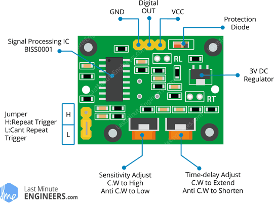
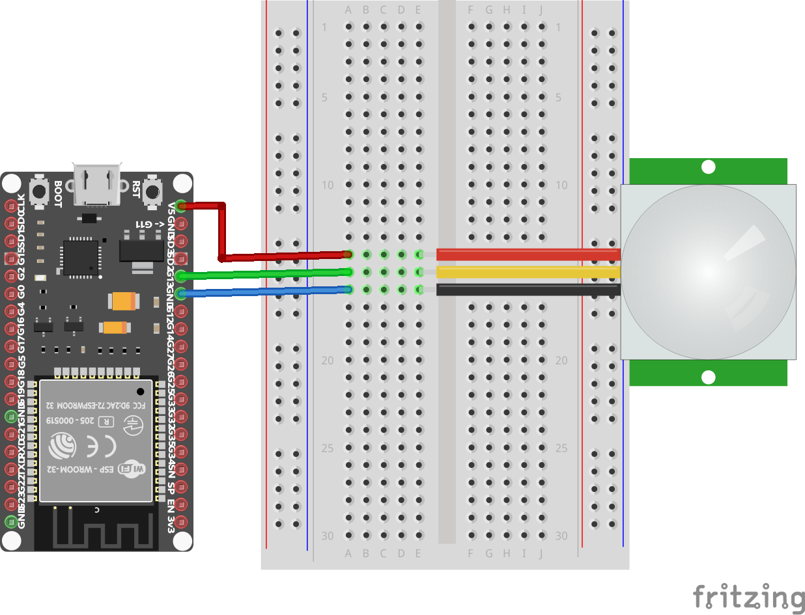

# Detekcia pohybu

## PIR senzor

Pasívny infračervený senzor (PIR) je elektronický senzor, ktorý zisťuje infračervené svetlo (IR) vyžarujúce z objektov v jeho zornom poli. PIR senzory sa veľmi často používajú v detektoroch pohybu.


Pri výbere PIR senzora dbajte aj na to, aké napätie potrebujete na jeho napájanie. Napr. PIR senzor HC-SR501 môžete napájať jednosmerným napätím v rozsahu od _4.5_ do _12V_. To znamená, že ak vaše _ESP32_ budete napájať z _3.3V_ batérie, nebude to stačiť aj na napájanie tohto senzora. Ak ale použijete PIR senzor AM312, ktorý môže byť napájaný v rozsahu od _2.7_ do _12V_, môžete ho bez problémov napájať aj z _3.3V_ zdroja.

Výstup zo senzoru má buď úroveň `LOW` v prípade, že žiadny pohyb zistený nebol, alebo `HIGH`, ak bol pohyb detegovaný. Veľkosť výstupného napätia je v tomto prípade obyčajne na úrovni _3.3V_, takže nepotrebujete použiť žiadny ochranný odpor na pine mikrokontroléra. Preventívne si však overte aj tento údaj, aby ste úspešne neodpálili niektorý zo vstupov vášho mikrokontroléra.



PIR senzor HC-SR501 má na sebe aj dva potenciometre, pomocou ktorých je možné nastaviť:

* **citlivosť** - umožňuje nastaviť maximálnu vzdialenosť, v ktorej môže byť pohyb detegovaný; rozsah  je od _3_ do _7_ metrov
* **čas** - umožňuje nastaviť to, ako dlho bude na výstupe úroveň `HIGH`v prípade zistenia pohybu; rozsah hodnôt je od _3_ do _300_ sekúnd

Pre testovanie odporúčame aj jeden aj druhý potenciometer nastaviť na minimálne hodnoty. To docielite jeho otočením na doraz proti smeru hodinových ručičiek.

## Schéma zapojenia

Napájanie PIR senzora je pripojené priamo na _5V_. Dátový signál je pripojený na GPIO pin _13_ mikrokontroléra _ESP32_. Schéma zapojenia je zobrazená na nasledujúcom obrázku:



## REPL

Začneme tým, že z balíka `machine` importujeme triedu `Pin`:

```python
>>> from machine import Pin
```

Dátový pin z PIR senzora je na GPIO pin _13_ mikrokontroléra _ESP32_. Nasledovným príkazom vytvoríme objekt triedy `Pin`, z ktorého budeme čítať výstup z PIR senzora:

```python
>>> sensor = Pin(13, Pin.IN)
```

Otestovať funkcionalitu senzora môžeme jednoducho volaním metódy `.value()` nad objektom `sensor`. V prípade, že k žiadnemu pohybu nedošlo, vráti hodnotu `0`. 

```python
>>> sensor.value()
0
```

Ak však k pohybu došlo a zatiaľ neuplynul čas, počas ktorého si senzor pohyb pamätá, vráti funkcia hodnotu `1`.

```pyhon
>>> sensor.value()
1
```

## Riešenie

V nasledujúcom výpise sa nachádza kód, ktorý jednoducho len zobrazuje aktuálny stav PIR senzora.  Pomocou funkcie `sleep()` zabezpečíme pozastavenie vykonávania programu po dobu _0.5_ sekundy.

```python
from machine import Pin
from time import sleep

sensor = Pin(13, Pin.IN)
while True:
    value = sensor.value()
    print(value)
    sleep(1)
```


## Ďalšie úlohy

1. Aktuálny stav detegovaného pohybu signalizujte blikaním pripojenej LED diódy alebo pípaním pripojeného bzučiaka.
2. Vytvorte jednoduchý poplašný systém založený na princípe fungovania PIR senzoru. Pri zistení pohybu začne systém signalizovať buď svetlom alebo zvukom, že k pohybu došlo. Poplach zrušíte stlačením tlačidla, ktoré počká dostatočne dlhý čas (vzhľadom na nastavenie hodnoty času PIR senzora). Následne sa systém znova aktivuje.
3. K riešeniu predchádzajúcej úlohy pripojte ďalšie tlačidlo a stavovú LED diódu. Pomocou nového tlačidla budete vedieť poplašné zariadenie vypnúť alebo uviesť do stavu pohotovosti. To znamená, že ak nie je systém aktivovaný, pohyb nebude signalizovaný. Až po zmene stavu novým tlačidlom sa rozsvieti nová LED dióda, ktorá bude signalizovať práve to, že systém je aktivovaný. Samozrejme môžete dať používateľovi dostatočný čas na opustenie stráženého priestoru, čo môžete signalizovať pípaním alebo blikaním LED diódy, kým tento časový interval neuplynie.

## Ďalšie zdroje

* [How HC-SR501 PIR Sensor Works & Interface It With Arduino](https://lastminuteengineers.com/pir-sensor-arduino-tutorial/)
* [Passive infrared sensor](https://en.wikipedia.org/wiki/Passive_infrared_sensor)

## Licencia

Pokiaľ nie je uvedené inak, obsah tohto dokumentu je licencovaný licenciou [Creative Commons Attribution-NonCommercial-ShareAlike 4.0 International (CC BY-NC-SA 4.0)](https://creativecommons.org/licenses/by-nc-sa/4.0/).

   
